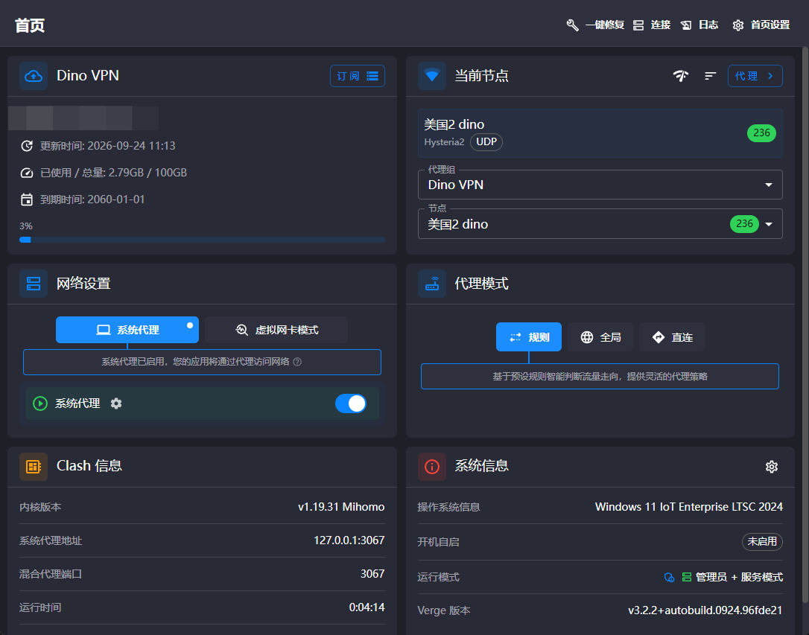
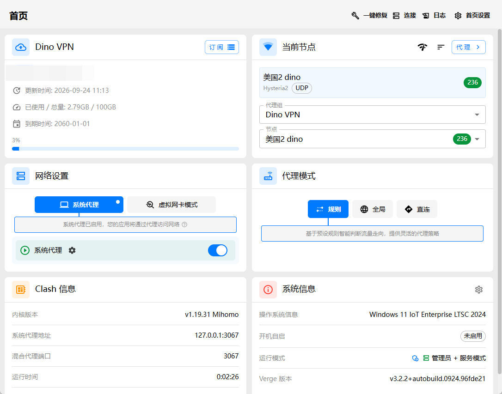

<h1 align="center">
  
  <br>
  DinoVPN
</h1>

<p align="center">
  基于 Tauri 2 和 Mihomo 的跨平台代理客户端，支持 Windows、macOS 和 Linux。
</p>

<p align="center">
  <a href="https://github.com/zhusang/clash-verge-rev/releases">下载安装</a> ·
  <a href="./Changelog.md">更新日志</a> ·
  <a href="https://github.com/zhusang/clash-verge-rev/issues">问题反馈</a>
</p>

DinoVPN 是基于 [Clash Verge Rev](https://github.com/clash-verge-rev/clash-verge-rev) 维护的衍生版本。本仓库提供 DinoVPN 的源码和安装包，上游项目与依赖的致谢见文末。

## 主要功能

- 内置 [Mihomo（Clash.Meta）](https://github.com/MetaCubeX/mihomo) 内核，支持切换稳定版与 Alpha 版内核。
- 订阅与配置文件管理，支持 Merge 合并、Script 脚本增强和配置语法提示。
- 系统代理、系统代理守卫和 TUN（虚拟网卡）模式。
- 可视化节点与规则编辑。
- 配置的本地备份与 WebDAV 备份管理。
- 深色与浅色主题、自定义主题颜色、代理组及托盘图标、CSS 注入。

## 界面预览

以下图片用于展示界面布局，实际界面以当前版本为准。

| 深色主题 | 浅色主题 |
| --- | --- |
|  |  |

## 下载与安装

前往 [本仓库 Releases 页面](https://github.com/zhusang/clash-verge-rev/releases)，展开对应版本下的 **Assets**，按操作系统和 CPU 架构选择安装包。可下载的平台和格式以实际发布附件为准。

| 平台 | 安装包选择 |
| --- | --- |
| Windows | 按设备架构选择 x64 或 ARM64 安装包。 |
| macOS 11 及以上 | Intel 芯片选择 x64，Apple Silicon 选择 ARM64。 |
| Linux | 按发行版、包格式和 CPU 架构选择对应安装包。 |

### 版本选择

- **正式版**：在 Releases 中选择未标记为预发布的版本。
- **AutoBuild**：用于测试的滚动构建，可能存在未修复问题；如已发布，可从 [AutoBuild 页面](https://github.com/zhusang/clash-verge-rev/releases/tag/autobuild) 下载。

### 当前分支说明

- 应用自动更新已停用，升级时请手动下载并安装新版本。这不影响订阅更新和内核管理。
- macOS 安装包采用无需开发者证书的 ad-hoc 签名，未经过 Apple 公证。首次启动可能受到 Gatekeeper 限制，请确认安装包来源可信。

## 使用帮助与反馈

- 通用安装与使用方法可参考 [上游文档](https://clash-verge-rev.github.io/) 和 [常见问题](https://clash-verge-rev.github.io/faq/windows.html)。上游说明可能与 DinoVPN 当前版本存在差异。
- DinoVPN 的问题请提交至 [本仓库 Issues](https://github.com/zhusang/clash-verge-rev/issues)，并附上系统、应用版本、复现步骤和相关日志。
- 提交日志或截图前，请移除订阅地址、密码、令牌等敏感信息。

## 本地开发

### 环境准备

- Node.js：建议与 CI 使用的 `24.14.1` 保持一致。
- Rust：使用 [rust-toolchain.toml](./rust-toolchain.toml) 指定的工具链。
- pnpm：使用 [package.json](./package.json) 中指定的 `10.32.1`。
- 按 [Tauri 2 环境准备文档](https://v2.tauri.app/start/prerequisites/) 安装对应平台的系统依赖。

### 安装依赖并启动

```shell
pnpm install
pnpm run prebuild
pnpm dev
```

`prebuild` 会下载 Mihomo 内核和服务二进制文件，需要能够访问相应的下载源。`pnpm dev` 启动完整的 Tauri 桌面应用。

### 构建安装包

```shell
pnpm build
```

更多开发与贡献说明见 [CONTRIBUTING.md](./CONTRIBUTING.md)。欢迎向本仓库提交 Issue 和 Pull Request。

## 致谢

本项目基于 Clash Verge Rev，并受益于以下开源项目及其贡献者：

- [Clash Verge Rev](https://github.com/clash-verge-rev/clash-verge-rev)：本项目的上游基础。
- [Clash Verge](https://github.com/zzzgydi/clash-verge)：基于 Tauri 的跨平台 Clash 图形客户端。
- [Tauri](https://github.com/tauri-apps/tauri)：桌面应用框架。
- [Clash](https://github.com/Dreamacro/clash)：基于规则的网络隧道工具。
- [Mihomo](https://github.com/MetaCubeX/mihomo)：本项目使用的代理内核。
- [Clash for Windows](https://github.com/Fndroid/clash_for_windows_pkg)：Clash 图形客户端。
- [Vite](https://github.com/vitejs/vite)：前端构建工具。

## 许可证

本项目采用 GPL-3.0 许可证，详见 [LICENSE](./LICENSE)。
